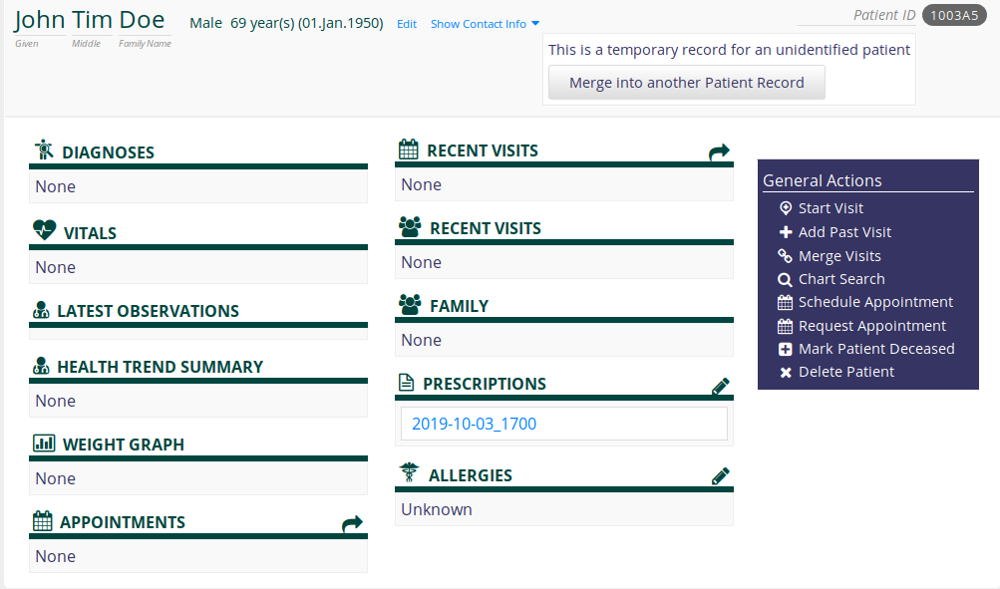
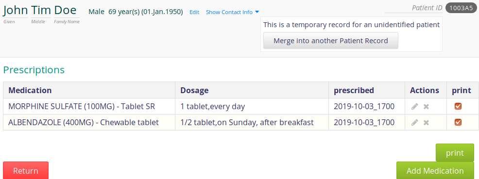

Prescription print
------------------

Add medications of a list, and mark them as 'to print' - onclick a pdf file is created.

# 1. Config

## 1.1.1 api

config.properties: name of medications-list csv-file, column of: id, 'description' = String to show

messages.properties: EN, FR, ES: for the UI

druglist[any name].csv: comma separated list of drug names, and id.

Only 1 value is taken for the prescription, that is why, the 'description' is composed of: drug name, dosage, dosage form (e.g. pill); or composition in case of a multi-drug.

The druglist can be created and added, with these 2 columns. The druglist is read into a table.

## 1.1.2 Change these files

a/ (rename to .jar) unzip the omod-file (e.g.: prescription-1.0.0.omod)

> extracted folder: prescription-1.0.0.omod_FILES

b/ change the files

c/ again, produce the .omod (jar): 

> jar -cvfM prescription-1.0.0.omod -C prescription-1.0.0.omod_FILES/ . 

// jar -cvfM output -C input space dot


## 1.2 runtime.properties

The runtime.properties is created when the app is run the first time.

The provider (e.g. clinic) address is set on top of a prescription.

Add this 3 lines to runtime.properties:

> prescription_address_1=ABC hospital

> prescription_address_2=21 health street

> prescription_address_3=Mytown, Mycountry

Then to re-start the app.

==============================================
# 2 roles, access rights

## 2.1 privileges

> Task: Prescription Modify

can add a medication, can group medications to print them in a prescription

idea: that is a doctor, who can write a prescription

=======

> Task: Prescription View

can see the 'download link' of a prescription (i.e. the pdf is created on the fly)

idea: that is a reception clerk who additionally prints paper prescriptions out

=======

## 2.2 example: add new roles, with those privileges - please note!

! Please note: the in-built roles of e.g. 'doctor' - are changeable, however, they are reset after re-start of the server. 
That is why, for additional privileges, 'new' roles have to be created.


in: Admin view - Users - manage roles

Add Role:

> Role: 'Doctor and prescription'

---

a/ Here, 'copy' all _Inherited Roles_ from the in-built role 'Organizational: Doctor'


Inherited Roles:

> Application: Enters ADT Events // right column

> Application: Records Allergies // left column

> Application: Requests Appointments // left

> Application: Sees Appointment Schedule // right

> Application: Uses Patient Summary // right

> Application: Writes Clinical Notes

Please scroll down the page entirely, button: 'save role'

(By saving these inherited roles, the corresponding privileges are also set - blue background).

---

b/ Add the additional privileges:


Privileges:

(Please find those 2, and 'click' onto them:)

> Task: Prescription Modify

> Task: Prescription View


Please scroll down the page entirely, button: 'save role'

=====

---
in: Admin view - Users - manage roles

Add Role:

> Role: 'Registration clerk and prescription'


---
a/ Here, 'copy' all _Inherited Roles_ from the in-built role 'Organizational: Registration Clerk'


Inherited Roles:

> Application: Registers Patients // right column

> Application: Schedules Appointments // left column

> Application: Sees Appointment Schedule // right column

> Provider // right column


Please scroll down the page entirely, button: 'save role'

(By saving these inherited roles, the corresponding privileges are also set - blue background).

---

b/ Add one additional privilege:


Privileges:

(Please find it, and 'click' onto it:)

> Task: Prescription View

---

c/ Add one additional role:

Inherited Roles: // top of page

> Application: Uses Patient Summary

(Uses Patient Summary: to see the patient dashboard)


Please scroll down the page entirely, button: 'save role'

---
==============

## 2.3 example: add users with those privileges

in: Admin view - Users - manage users


add: (create a new person)
Please note: this person needs to be a 'provider' to "register a patient"

> User: Username: Receptionist1, Password: Password1


Provider account: 

> Create a Provider account for this user // provider here


Roles

> Registration clerk and prescription

> Provider // provider here also


Please scroll down the page entirely, button: 'save user'


---
=======

in: Admin view - Users - manage users


add: (create a new person)

> User: Username: Doctor1, Password1

set 

> Role: Doctor and prescription


Please scroll down the page entirely, button: 'save user'

---
==============

# 3. Usage

The .omod file provided within this repository can be used 'as is'. 

## 3.1 The application itself

a/ Using e.g. the standalone application 

> git clone -b openmrs-emr2 --single-branch https://github.com/openmrs/openmrs-standalone --single-branch

and following the instructions in https://github.com/openmrs/openmrs-standalone to start it

b/ then to stop the application, find the file 'openmrs-standalone-runtime.properties' - that file was created by the application,

and please to add 3 lines like described above, in 1.2

c/ Download the .omod file from this git,  - add it via the admin-view as a module.


==============

# 4. Compilation

a/ cloning this github repository

b/ check the version number of the parent (= OpenMRS) in pom.xml


```
  <parent>
        <groupId >org.openmrs.maven.parents</groupId>
        <artifactId >maven-parent-openmrs-module</artifactId>
        <version>1.1.1</version>
  </parent>
```

Please compare with the version number here https://github.com/openmrs/openmrs-module-basicmodule/blob/master/pom.xml and in case, please adjust the version number

c/ please create a file “settings.xml” (location: e.g. next to the pom.xml)

Please insert into this settings.xml the content, like described here: https://wiki.openmrs.org/display/docs/Using+the+Module+Maven+Archetype

d/ compile, like described in the mentioned link and refer to this extra settings.xml file // e.g. with settings.xml in the same location like the pom.xml:

> mvn package -s settings.xml

The resulting module, then, is created in /omod/target/prescription….omod

==============

# 5. Screenshots

After adding the module: (the link in blue appears when a prescription was created)

<div align="center">
     
</div>

<br><br>

'Click' onto the 'pen', a prescription resp. medications to prescribe can be added. The available medications are taken from a file.csv, a simple list. Please see the explanation therefore, and how to change that list, above.

<div align="center">
     
</div>

<br><br>

Those lines that are marked with 'print' are added to a prescription. With 'print' those lines are stored as part of a prescription, and a link (please see the 1st image) is shown

<div align="center">
     
</div>

<br><br>

'Click' onto the link opens a pdf-preview of the 'prescription'. The data at the top, the clinic etc. are configurable, please see an explanation above.

<div align="center">
     
</div>


==============

# 6. Pdf print library

The library com.lowagie is used, instead of iText. com.lowagie is subject to the MPL/LGPL. The versions after 2.1.7 were renamed to itext, and, the licence was changed to the Affero General Public License v3/AGPL. Since com.lowagie supported our needs, we continued to use this library v. 2.1.7.


